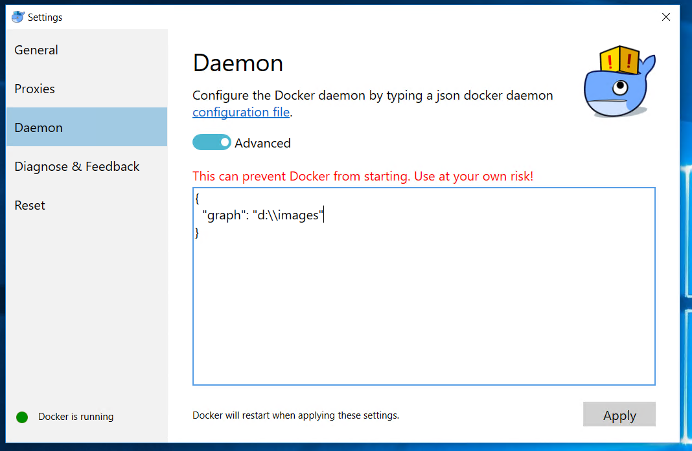

## Setting up development environment
To work/debug Windows containers you have 2 choices currently as far as OS choice is concerned. You can run it on Windows 10 or Windows 2016. Steps taken to setup development environment below were performed on Windows 10 (10.0.14393).
To prepare development environment
### Install docker
1. Download docker beta (at the time of the writing) version of docker for Windows (https://download.docker.com/win/beta/InstallDocker.msi)
2. Install docker and switch to Windows containers by right clicking on task bar icon
<BR>

<BR>
<!-- -->
3. If everything was done properly then you shall see white whale icon in taskbar

### Install Powershell tools for docker

1. Open Powershell prompt with administrative credentials and execute

```powershell
Register-PSRepository -Name DockerPS-Dev -SourceLocation https://ci.appveyor.com/nuget/docker-powershell-dev
Install-Module Docker -Repository DockerPS-Dev
```

2. To verify that both docker and powershell module for docker are installed properly execute following and check if you see network names `nat` in output

```powershell
PS C:\WINDOWS\system32> get-containernet

Id              Name            Driver
--              ----            ------
a50d2102b691... nat             nat
a7ab8d8c4df8... none            null
```

## Some housekeeping

Default docker installation will put all your downloaded container images as well the ones which you will create put on default drive (C:\), 
this can get pretty difficult to move once established, so if you are short on space on C drive and would like to move
location of images on different drive then follow instructions below.

1. Right click on docker image in taskbar and choose settings
2. Switch to daemon tab and click "Advanced". Put location of the drive/folder where you want your images to be stored at

<BR>

<BR>

